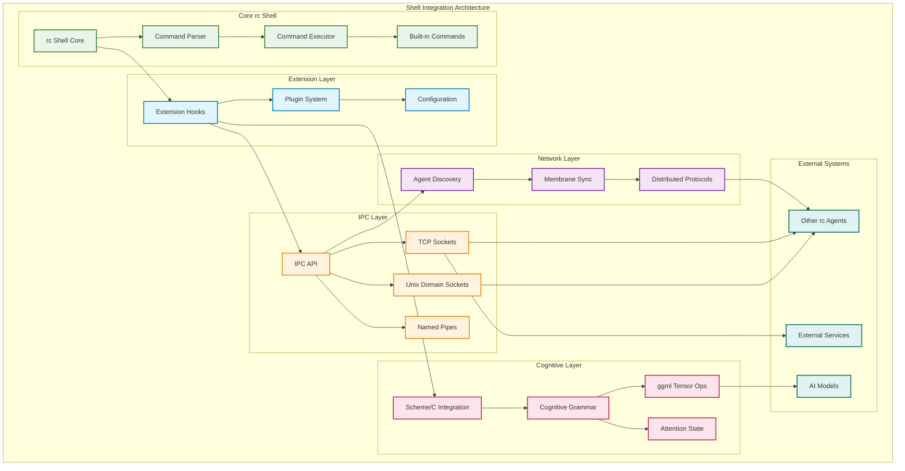

# Shell Integration

## Overview



This document describes the integration of cognitive grammar capabilities into the rc shell, including IPC modules, ggml function mapping, and Scheme/C interface hooks.

## IPC Layer Extensions

### Socket Communication
The shell now supports enhanced IPC through:
- Unix domain sockets for local agent communication
- TCP sockets for distributed network protocols
- Named pipes for process synchronization

### Implementation Details

#### Socket Interface Hooks
```c
// New functions added to rc.h for IPC support
extern int rc_ipc_listen(const char *path);
extern int rc_ipc_connect(const char *path);
extern int rc_ipc_send(int fd, const char *data, size_t len);
extern int rc_ipc_recv(int fd, char *buffer, size_t len);
```

#### Command Extensions
New shell commands for IPC operations:
- `ipc-listen <path>` - Create IPC listener
- `ipc-connect <path>` - Connect to IPC endpoint  
- `ipc-send <fd> <data>` - Send data via IPC
- `ipc-recv <fd>` - Receive data via IPC

## Scheme/C Integration

### Interface Hooks
Basic hooks for Scheme integration:
```c
// Scheme interface stubs
extern int scheme_init(void);
extern int scheme_eval(const char *expr);
extern char *scheme_call(const char *func, char **args);
extern void scheme_cleanup(void);
```

### Shell Command Integration
New commands for cognitive grammar operations:
- `scheme-eval <expression>` - Evaluate Scheme expression
- `hypergraph-encode <data>` - Encode data as hypergraph
- `pattern-match <pattern> <data>` - Pattern matching
- `attention-allocate <resources>` - Allocate attention

## ggml Tensor Operations

### Basic Tensor Interface
```c
// Tensor operation stubs
extern void *tensor_create(int *dims, int ndims);
extern void tensor_destroy(void *tensor);
extern int tensor_compute(void *tensor, const char *op);
extern void *tensor_membrane_alloc(int prime_factors[], int count);
```

### Shell Commands
- `tensor-create <dims>` - Create tensor with specified dimensions
- `tensor-op <tensor> <operation>` - Perform tensor operation
- `membrane-alloc <primes>` - Allocate prime factorization membrane

## Extension Architecture

### Plugin System
The shell supports loadable cognitive modules:
```c
typedef struct CognitiveModule {
    const char *name;
    int (*init)(void);
    int (*process)(const char *input, char **output);
    void (*cleanup)(void);
} CognitiveModule;

extern int register_cognitive_module(CognitiveModule *module);
```

### Hook Points
Strategic extension points throughout the shell:
- Command parsing hooks for cognitive grammar
- Execution hooks for attention allocation
- I/O hooks for distributed communication
- Memory management hooks for tensor operations

## Configuration

Cognitive features can be enabled/disabled via config.h:
```c
#define ENABLE_COGNITIVE_GRAMMAR 1
#define ENABLE_IPC_EXTENSIONS 1
#define ENABLE_SCHEME_INTEGRATION 1
#define ENABLE_TENSOR_OPERATIONS 1
```

## Build Integration

The Makefile has been extended to support cognitive components:
- Optional building of cognitive modules
- Scheme library integration
- ggml tensor library support
- IPC library dependencies